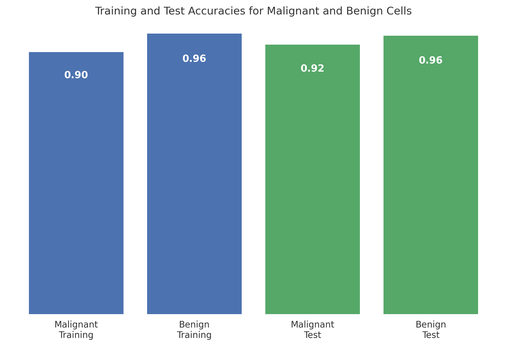

# Breast-Cancer-Classification-KNN

This project implements a Machine Learning model to classify breast mass tumors as **Malignant** or **Benign** using the **K-Nearest Neighbors (KNN)** algorithm.

##  Project Results
The model achieved high performance with a focus on medical diagnostic reliability.

* **Final Accuracy:** 94.4%
* **Optimized K-Value:** 7 neighbors
* **Training Score:** 93.9% 
* **Test Score:** 94.4%



> **Note:** The close proximity between training and testing scores indicates that the model generalizes well and is not suffering from overfitting.

##  Implementation Details
1. **Data Preprocessing:** Handled 30 clinical features including tumor radius, texture, perimeter, and area.
2. **Train-Test Split:** Utilized a 75/25 split ratio to ensure a robust and fair evaluation.
3. **Model Optimization:** Fine-tuned the `n_neighbors` parameter to find the optimal balance between bias and variance.
4. **Performance Analysis:** Conducted a granular analysis for both malignant and benign classes.


##  How to Run
1. **Clone the repository:**
   ```bash
   git clone [https://github.com/layanaljohani314/Breast-Cancer-Classification-KNN]
2. **Install dependencies:**
 ```bash
pip install -r requirements.txt


## Conclusion
With a 94.4% success rate, this KNN-based approach provides a reliable baseline for automated medical screening tools, effectively minimizing false diagnosis through optimized neighbor voting.
